##Subscription manager - Project Description
Welcome to my first full stack project! In this journey, I delved into various aspects of web development, tackling challenges and learning new skills along the way. This project represents a culmination of my efforts to understand the complexities of both front-end and back-end development, as well as the integration of a database.

#Application Overview
The project entails the creation of a full stack web application designed to gather specific data about user subscriptions. Here's a breakdown of how the application works:

User Registration and Authentication: Users are required to register an account or log in if they already have one. I implemented JWT authentication to enhance the security of the application.
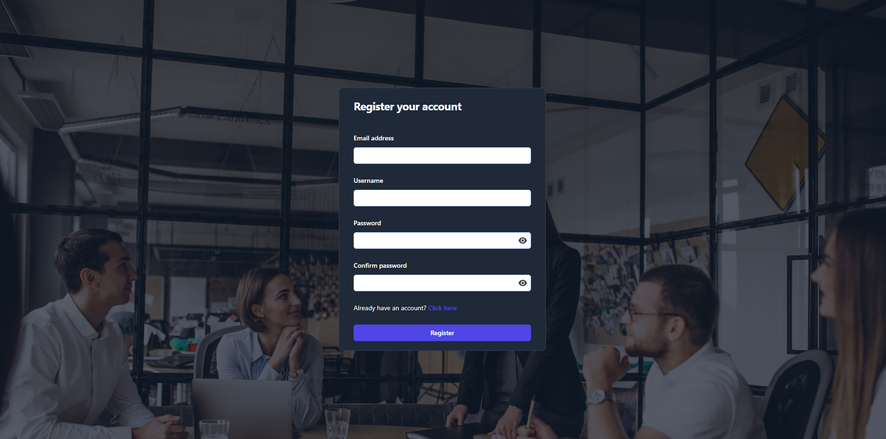

Multistep Form: After registration, users encounter a multistep form where they input various data:

Step 1: Personal information
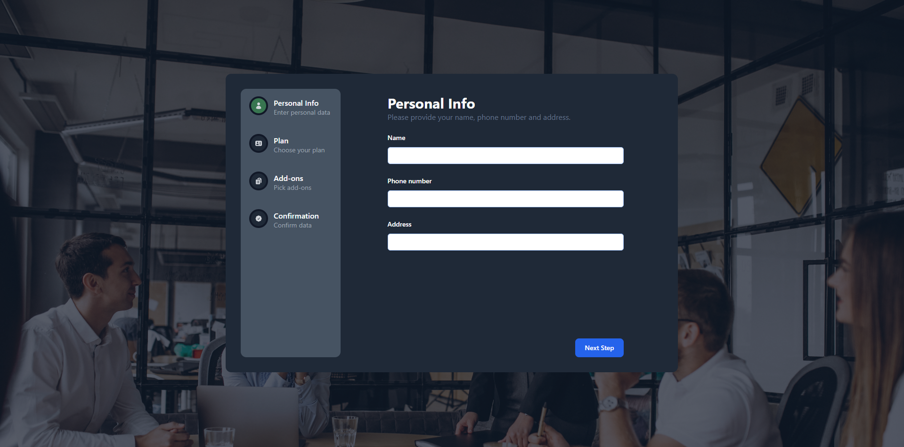

Step 2: Selection of pricing plan (monthly or annual)
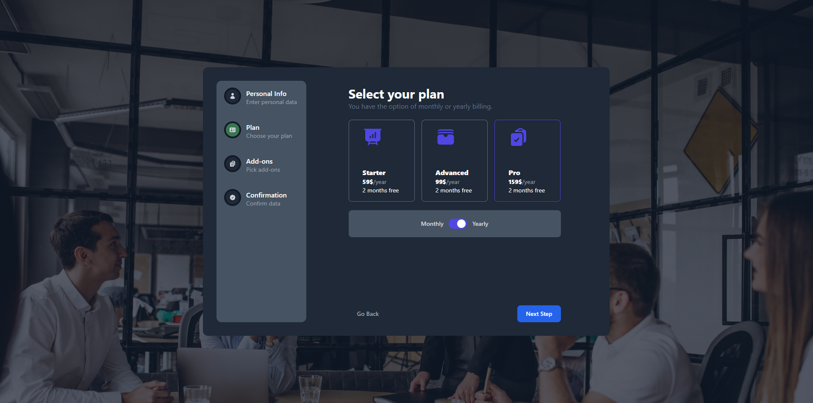
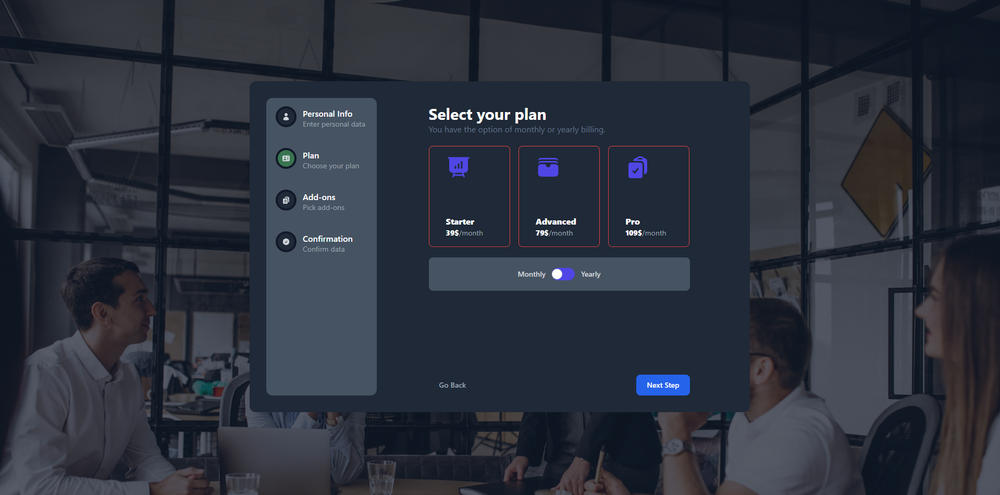

Step 3: Optional addons
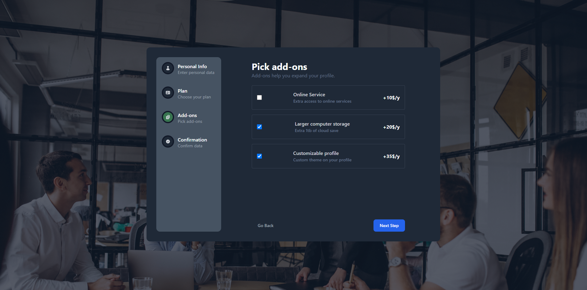

Step 4 - Summary Display: Upon completing the form, users are presented with a summary showcasing all the data they've entered and selected.
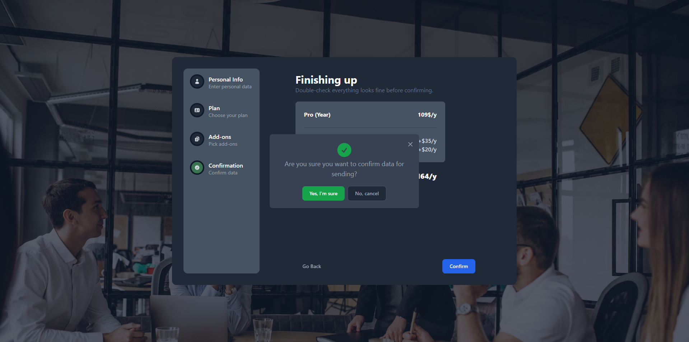
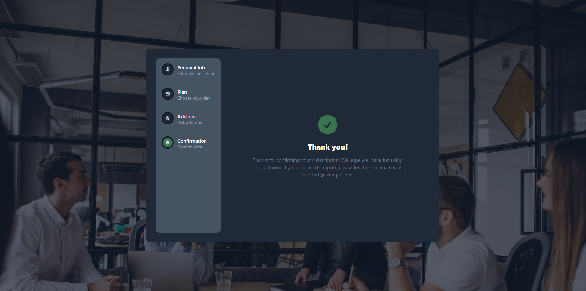

Also the web application is suitable for all standard screen sizes, here are some mobile responsive design examples:

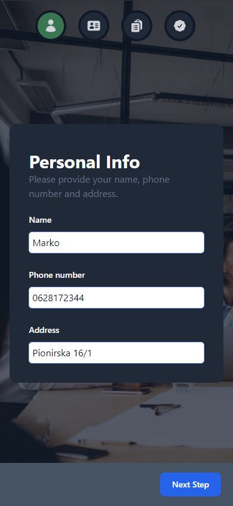
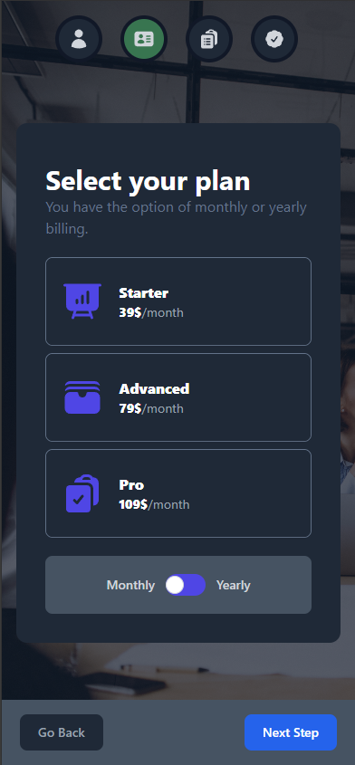
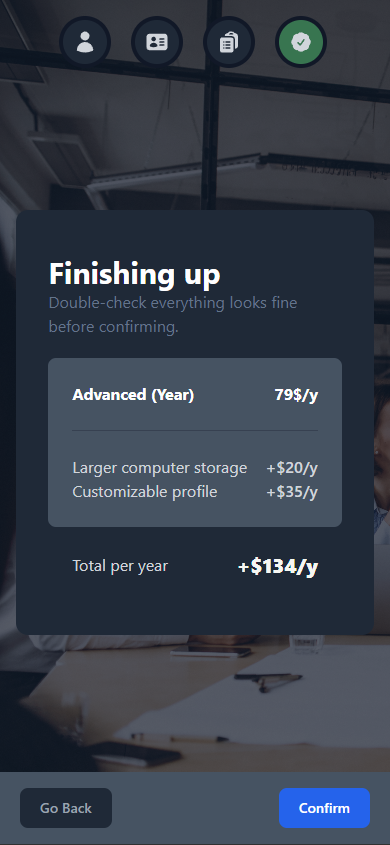
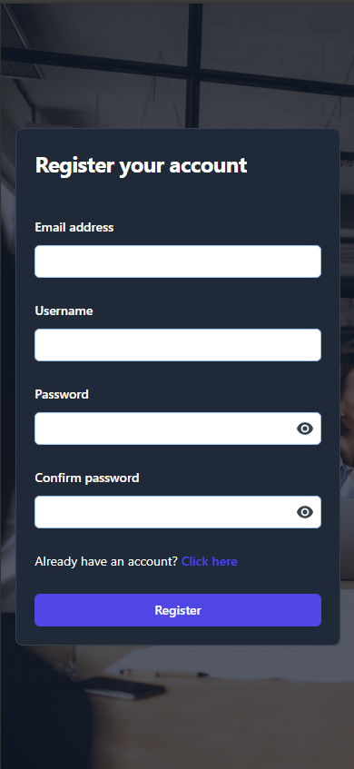

Data Handling: The collected data is sent to the server and stored in the database. Each user is assigned a unique user ID, and their corresponding data is linked to this ID within the database.

#Database Structure
Within the database, I've established three tables:

Users: The primary table containing user information.
Profiles: Linked to the Users table, storing additional profile data.
Subscriptions: Also linked to the Users table, storing subscription-related information.

#Learning Goals
My primary objective with this project was to gain proficiency in the entire registration/login process, encompassing both the backend and client-side aspects. Additionally, I aimed to enhance my skills in React.js, focusing on efficient coding practices and utilizing modern JavaScript features like ES6 syntax.

Moreover, I delved into the backend realm, aiming to understand the intricacies of:

Creating Routes: Establishing routes for handling various client requests.
Implementing Middleware: Employing middleware to enhance server functionality, such as logging, error handling, and authentication.
Data Encryption: Learning techniques for encrypting sensitive data to ensure its security.
Handling Responses: Managing responses sent back to the client, ensuring clarity and efficiency.
User Authentication: Implementing robust authentication mechanisms to verify user identities and protect sensitive resources.
Database Connectivity: Establishing connections to databases and executing queries to store and retrieve data efficiently.

By delving into these backend concepts, I aimed to gain a comprehensive understanding of full stack development, connecting frontend and backend technologies. This approach broadened my skills and underscored the interdependence of various components in web applications.

#Conclusion
While the immediate practical utility of the application might be limited, the true value lies in the skills and knowledge gained throughout its development. With further refinement and brainstorming, I believe this project could find meaningful applications in the real world. This project represents not only a milestone in my journey as a developer but also a testament to my dedication to continuous learning and improvement. Feel free to review the code and provide feedback, suggestions for improvements, or any other contributions you deem valuable.
